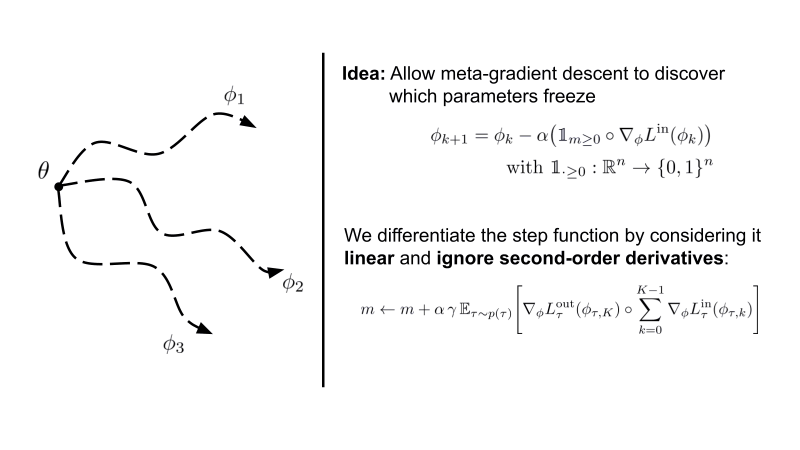

require 'kramdown'

# Learning where to learn - Gradient sparsity in meta and continual learning

In this paper, we investigate gradient sparsity found by [MAML](https://arxiv.org/abs/1703.03400/) in various continual and few-shot learning scenarios.\
Instead of only learning the initialization of neural network parameters, we additionally meta-learn parameters underneath 
a step function that stops gradient descent when smaller then 0.      

We term this version **Sparse-MAML** - Link to the paper [here](https://arxiv.org/abs/2110.14402).

Interestingly, we see that structured sparsity emerges in both the classic 
4-layer ConvNet as well as a ResNet-12 for few-shot learning. 
This is accompanied by improved robustness and generalisation across many 
hyperparameters.

Note that Sparse-MAML is an extremely simple variant of MAML that possesses only 
the possibility to shut on/off training of specific parameters compared to proper gradient modulation. 

This codebase implents the few-shot learning experiments that are presented in the paper.
To reproduce the results in the paper, please follow these instructions:

### Installation 
#1. Install a conda env: 

`conda create -n sparse-MAML`

#2. Activate the env: 

`source activate sparse-MAML`

#3. Install anaconda: 

`conda install anaconda`

#4. Install extra requiremetns (make sure you use the correct pip3): 

`pip3 install -r requirements.txt`

#5. Run: 

`chmod u+x run_sparse_MAML.sh`

#6. Execute: 

`./run_sparse_MAML.sh`

### Results

| MiniImageNet Few-Shot   | MAML  | ANIL  | BOIL  | sparse-MAML | sparse-ReLU-MAML |
|-------------------------|:-------:|:-------:|:-------:|:-------------:|:------------------:|
| 5-way 5-shot \| ConvNet | 63.15 | 61.50 | 66.45 | 67.03       |64.84             |
| 5-way 1-shot \| ConvNet | 48.07 | 46.70 | 49.61 | 50.35       |50.39             |
| 5-way 5-shot \| ResNet12  | 69.36 | 70.03 | 70.50 | 70.02         |73.01         |
| 5-way 1-shot \| ResNet12  | 53.91 | 55.25 | -     | 55.02          |56.39           |

BOIL results are taken from the original [paper](https://arxiv.org/abs/2008.08882).

--------------------------------------------------------
This code based is heavily build on top of [torchmeta](https://github.com/tristandeleu/pytorch-meta).
